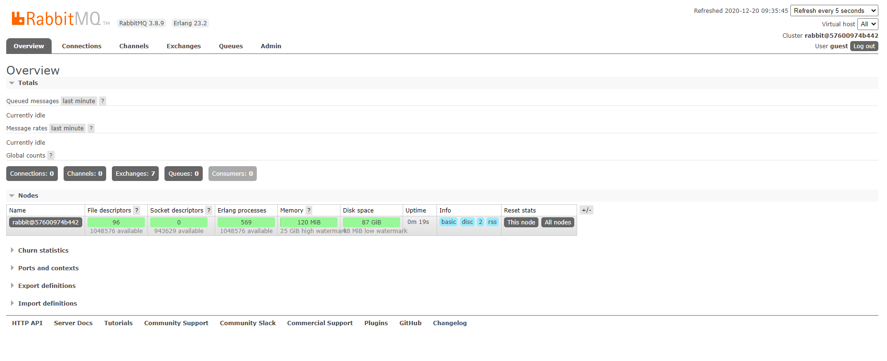

# Docker安装ActiveMQ和RabbitMQ

因学习Spring Boot 整合消息队列使用了ActiveMQ和RabbitMQ，记录下安装过程。

## docker下安装ActiveMQ

> https://developer.aliyun.com/article/572390

### 查询Docker镜像

```
docker search activemq
```

### 下载Docker镜像

```
docker pull webcenter/activemq
```

### 创建&运行ActiveMQ容器

```
docker run -d --name myactivemq -p 61616:61616 -p 8161:8161 webcenter/activemq
```

### 查看WEB管理页面：

浏览器输入`http://127.0.0.1:8161/`，点击`Manage ActiveMQ broker`使用默认账号/密码：`admin`/`admin`进入查看


## docker安装 RabbitMQ

> https://www.jianshu.com/p/14ffe0f3db94

这里注意获取镜像的时候要获取management版本的，不要获取last版本的，management版本的才带有管理界面。

### 获查询镜像

```bash
 docker search rabbitmq:management
```


### 获取镜像

```bash
docker pull rabbitmq:management
```

可以看到如下结果

```bash
[hzh@localhost ~]$ docker pull rabbitmq:management
management: Pulling from library/rabbitmq
f22ccc0b8772: Pull complete
3cf8fb62ba5f: Pull complete
e80c964ece6a: Pull complete
c1d2d6c5864b: Pull complete
a1d14468c24f: Pull complete
ac5224ea1eb3: Pull complete
8da622546a6c: Pull complete
5f20211ad28c: Pull complete
553fbbbec0d8: Pull complete
87e159513515: Pull complete
e7ad102c950f: Pull complete
fc664c88ed06: Pull complete
4c05edd7de3b: Pull complete
Digest: sha256:83fb3d109a3775bd8bc38629864bf54c074c41c5e34b608987b0b524ba707aff
Status: Downloaded newer image for rabbitmq:management
docker.io/library/rabbitmq:management
```


### 运行镜像

```bash
[hzh@localhost ~]$ docker run -d -p 5672:5672 -p 15672:15672 --name rabbitmq rabbitmq:management
57600974b4423618a9339d75212bba4770231e4b9605c81c8f73d53a7d4567f8
```


### 访问管理界面

访问管理界面的地址就是 http://59.xx.xx.xx:15672，可以使用默认的账户登录，用户名和密码都guest，如：

