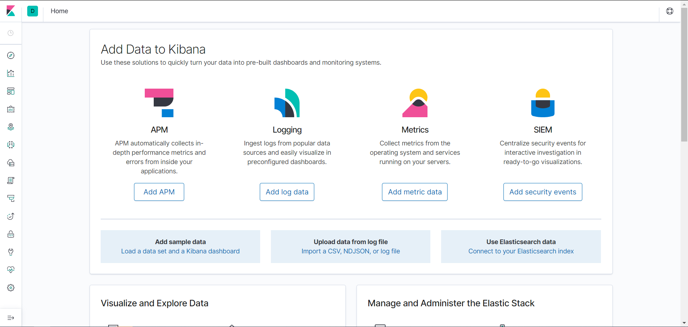

<!-- @format -->

## ElasticSearch

### 安装 ElasticSearch

```bash
docker pull elasticsearch:7.4.2
docker pull kibana:7.4.2
```

### 配置

```bash
mkdir -p /mydata/elasticsearch/config
mkdir -p /mydata/elasticsearch/data
echo "http.host: 0.0.0.0" >/mydata/elasticsearch/config/elasticsearch.yml
chmod -R 777 /mydata/elasticsearch/
```

### 启动

```bash
docker run --name elasticsearch -p 9200:9200 -p 9300:9300 \
-e  "discovery.type=single-node" \
-e ES_JAVA_OPTS="-Xms64m -Xmx512m" \
-v /mydata/elasticsearch/config/elasticsearch.yml:/usr/share/elasticsearch/config/elasticsearch.yml \
-v /mydata/elasticsearch/data:/usr/share/elasticsearch/data \
-v  /mydata/elasticsearch/plugins:/usr/share/elasticsearch/plugins \
-d elasticsearch:7.4.2
```

### 访问

http://pi:9200

```
{
  "name" : "60bd81d4dd49",
  "cluster_name" : "elasticsearch",
  "cluster_uuid" : "xHVH75NkTh2fOqIUGnzfoQ",
  "version" : {
    "number" : "7.4.2",
    "build_flavor" : "default",
    "build_type" : "docker",
    "build_hash" : "2f90bbf7b93631e52bafb59b3b049cb44ec25e96",
    "build_date" : "2019-10-28T20:40:44.881551Z",
    "build_snapshot" : false,
    "lucene_version" : "8.2.0",
    "minimum_wire_compatibility_version" : "6.8.0",
    "minimum_index_compatibility_version" : "6.0.0-beta1"
  },
  "tagline" : "You Know, for Search"
}
```

## kibana

### 安装

```bash
docker run --name kibana -e ELASTICSEARCH_HOSTS=http://ip:9200 -p 5601:5601 -d kibana:7.4.2
```

### 访问

```bash
http://ip:5601/
```



### 设置开机启动

```bash
docker update elasticsearch --restart=always
docker update kibana  --restart=always
```

## 使用

https://www.elastic.co/guide/en/elasticsearch/reference/7.5/getting-started-search.html
