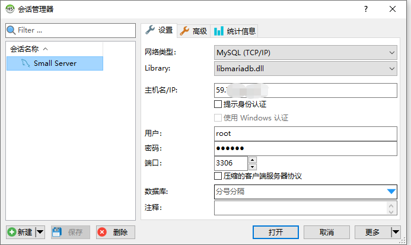

# Docker里安装使用Mysql

## 安装Docker

Docker安装教程：https://docs.docker.com/engine/install/centos/

## 安装Mysql

### 拉取镜像

这里用了mysql:5.7

```bash
[hzh@localhost ~]$ docker pull mysql:5.7
5.7: Pulling from library/mysql
852e50cd189d: Pull complete
29969ddb0ffb: Pull complete
a43f41a44c48: Pull complete
5cdd802543a3: Pull complete
b79b040de953: Pull complete
938c64119969: Pull complete
7689ec51a0d9: Pull complete
36bd6224d58f: Pull complete
cab9d3fa4c8c: Pull complete
1b741e1c47de: Pull complete
aac9d11987ac: Pull complete
Digest: sha256:8e2004f9fe43df06c3030090f593021a5f283d028b5ed5765cc24236c2c4d88e
Status: Downloaded newer image for mysql:5.7
docker.io/library/mysql:5.7
```

### 查看本地镜像

```bash
[hzh@localhost ~]$ docker images
REPOSITORY          TAG                 IMAGE ID            CREATED             SIZE
mysql               5.7                 ae0658fdbad5        8 days ago          449MB
hello-world         latest              bf756fb1ae65        11 months ago       13.3kB
```

### 创建所需目录和配置

#### 用以挂载外部配置文件和数据目录：

```bash
mkdir data
mkdir data/mysql3306
mkdir data/mysql3306/conf.d
mkdir data/mysql3306/data/
==========================
[hzh@localhost mysql]$ pwd
/home/hzh/mysql
[hzh@localhost mysql]$ tree
.
└── data
    └── mysql3306
        ├── conf.d
        └── data	
4 directories, 0 files
```

#### 编辑配置

```bash
[hzh@localhost mysql]$ cat data/mysql3306/my.cnf
# vim ~/mysql/data/mysql3306/my.cnf
[client]
port= 3306
socket  = /tmp/mysql.sock
#default-character-set = utf8mb4

## The MySQL server
[mysqld]
port = 3306
socket  = /tmp/mysql.sock
user = mysql
skip-external-locking
skip-name-resolve
#skip-grant-tables
#skip-networking
###################################### dir
#basedir=/usr/local/mysql
datadir=/var/lib/mysql
tmpdir=/var/lib/mysql
secure_file_priv=/var/lib/mysql
###################################### some app
log-error=mysql.err
pid-file=/var/lib/mysql/mysql.pid
local-infile=1
event_scheduler=0
federated
default-storage-engine=InnoDB
#default-time-zone= '+8:00'
log_timestamps=SYSTEM
character-set-client-handshake = FALSE
character-set-server = utf8mb4
collation-server = utf8mb4_unicode_ci
init_connect='SET NAMES utf8mb4'
#5.6
explicit_defaults_for_timestamp=true

#fulltext
innodb_optimize_fulltext_only
ft_min_word_len=1
#ft_max_word_len
innodb_ft_min_token_size=1

###################################### memory allocate and myisam configure
max_connections=3000
#back_log=200
max_connect_errors=10000

key_buffer_size = 16M
max_allowed_packet = 16M
table_open_cache = 10240
sort_buffer_size = 2M
read_buffer_size = 2M
read_rnd_buffer_size = 2M
join_buffer_size=2M
myisam_sort_buffer_size = 4M
#net_buffer_length = 2M
thread_cache_size = 24

query_cache_type=1
query_cache_size=256M
query_cache_limit=32M

tmp_table_size=1G
max_heap_table_size=1G

#thread_concurrency =48
###################################### replication
server-id = 19216810951
log-bin=mysql-bin
binlog_format=mixed
max_binlog_size=1G
#binlog_cache_size=512M
log_slave_updates=true
log_bin_trust_function_creators=true
expire_logs_days=15
replicate-ignore-db=mysql
replicate-ignore-db=test
replicate-ignore-db=information_schema
replicate-ignore-db=performance_schema
replicate-wild-ignore-table=mysql.%
replicate-wild-ignore-table=test.%
replicate-wild-ignore-table=information_schema.%
replicate-wild-ignore-table=performance_schema.%

lower_case_table_names = 1
#read_only=1
master_info_repository=TABLE
relay_log_info_repository=TABLE

###################################### slow-query
long_query_time=1
slow_query_log=1
slow_query_log_file=/var/lib/mysql/slow-query.log
interactive_timeout=600
wait_timeout=600
#log_queries_not_using_indexes=1

###################################### innodb configure
innodb_file_per_table
#innodb_file_format=Barracuda
#innodb_io_capacity=200

innodb_data_home_dir = /var/lib/mysql
#innodb_data_file_path = ibdata1:2000M;ibdata2:10M:autoextend
innodb_log_group_home_dir = /var/lib/mysql
innodb_buffer_pool_size =4G
# Set .._log_file_size to 25 % of buffer pool size
innodb_log_file_size = 1G
innodb_log_files_in_group = 3
innodb_log_buffer_size = 32M
#innodb_lock_wait_timeout = 50
innodb_flush_log_at_trx_commit = 1
sync_binlog=0
sql-mode="STRICT_TRANS_TABLES,NO_AUTO_CREATE_USER,NO_ENGINE_SUBSTITUTION"
##########################################
[mysqldump]
quick
max_allowed_packet = 16M

[mysql]
no-auto-rehash
default-character-set = utf8mb4
prompt=\U \h \R:\m:\s \d>

[myisamchk]
key_buffer_size = 20M
sort_buffer_size = 20M
read_buffer = 2M
write_buffer = 2M

[mysqlhotcopy]
interactive-timeout
```

### 启动容器

```bash
docker run --restart=always --privileged=true -v /etc/localtime:/etc/localtime:ro -d -v /home/hzh/mysql/data/mysql3306/data/:/var/lib/mysql -v /home/hzh/mysql/data/mysql3306/conf.d:/etc/mysql/conf.d -v /home/hzh/mysql/data/mysql3306/my.cnf:/etc/mysql/my.cnf -p 3306:3306 --name mysql5.7 -e MYSQL_ROOT_PASSWORD=123456 mysql:5.7
```

参数说明：
--restart=always： 当Docker 重启时，容器会自动启动。
--privileged=true：容器内的root拥有真正root权限，否则容器内root只是外部普通用户权限
-v /opt/mysql/conf.d/my.cnf:/etc/my.cnf：映射配置文件
-v /opt/mysql/data/:/var/lib/mysql：映射数据目录
-v /etc/localtime:/etc/localtime:ro：设置容器的时间与宿主机同步
-p 3306:3306：将容器的3306端口映射到主机的3306端口
-e MYSQL_ROOT_PASSWORD=123456：设置mysql的root密码

### 查看容器

```bash
[hzh@localhost mysql]$ docker ps
CONTAINER ID        IMAGE               COMMAND                  CREATED             STATUS              PORTS
                     NAMES
d5c69ef90e72        mysql:5.7           "docker-entrypoint.s…"   23 seconds ago      Up 23 seconds       0.0.0.0:3306->3306/tcp, 33060/tcp   mysql5.7
```

### 登录Mysql




## 参考

https://www.hellojava.com/a/86680.html 

https://docs.docker.com/engine/install/centos/