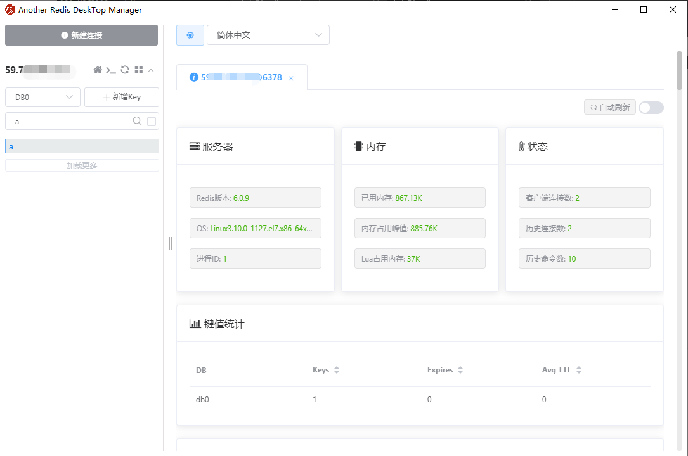

# Docker里安装使用Redis

## 安装Docker

Docker安装教程：https://docs.docker.com/engine/install/centos/


## 安装Redis

### 拉取镜像

```bash
docker pull redis
```

### 启动容器

```bash
docker run --name redis -p 6378:6379 -d --restart=always redis redis-server --appendonly yes --requirepass "123456"
```

参数讲解：

`--name`：为容器取一个唯一的名字

`-p`：端口映射，把宿主机的端口映射到容器内的端口

`--restar=always`：随容器启动而启动

`redis-server --appendonly yes`：在容器里执行`redis-server`命令，打开redis持久化

`--requirepass`：密码

### 连接测试

#### 命令行

```bash
docker ps 查看CONTAINER ID
docker exec -it xxxxxx redis-cli
```

```bash
[hzh@localhost ~]$ docker exec -it 8d4ad21aad45 redis-cli
127.0.0.1:6379> info  # 容器有配置密码，需要先验证密码
NOAUTH Authentication required.
127.0.0.1:6379> auth 123456
OK
127.0.0.1:6379> info
# Server
redis_version:6.0.9
redis_git_sha1:00000000
redis_git_dirty:0
redis_build_id:12c354e6793cb936
redis_mode:standalone
os:Linux 3.10.0-1127.el7.x86_64 x86_64
arch_bits:64
multiplexing_api:epoll
atomicvar_api:atomic-builtin
gcc_version:8.3.0
process_id:1
run_id:f7bf38ea25790793e78b2d3f11f3a974e15b1831
tcp_port:6379
uptime_in_seconds:72
uptime_in_days:0
hz:10
configured_hz:10
lru_clock:12893617
executable:/data/redis-server
config_file:
io_threads_active:0

# Clients
connected_clients:1
client_recent_max_input_buffer:8
client_recent_max_output_buffer:0
blocked_clients:0
tracking_clients:0
clients_in_timeout_table:0

# Memory
used_memory:866768
used_memory_human:846.45K
used_memory_rss:4739072
used_memory_rss_human:4.52M
used_memory_peak:866768
used_memory_peak_human:846.45K
used_memory_peak_perc:100.17%
used_memory_overhead:823808
used_memory_startup:803296
used_memory_dataset:42960
used_memory_dataset_perc:67.68%
allocator_allocated:1012880
allocator_active:1187840
allocator_resident:4345856
total_system_memory:67212570624
total_system_memory_human:62.60G
used_memory_lua:37888
used_memory_lua_human:37.00K
used_memory_scripts:0
used_memory_scripts_human:0B
number_of_cached_scripts:0
maxmemory:0
maxmemory_human:0B
maxmemory_policy:noeviction
allocator_frag_ratio:1.17
allocator_frag_bytes:174960
allocator_rss_ratio:3.66
allocator_rss_bytes:3158016
rss_overhead_ratio:1.09
rss_overhead_bytes:393216
mem_fragmentation_ratio:5.75
mem_fragmentation_bytes:3914808
mem_not_counted_for_evict:0
mem_replication_backlog:0
mem_clients_slaves:0
mem_clients_normal:20504
mem_aof_buffer:8
mem_allocator:jemalloc-5.1.0
active_defrag_running:0
lazyfree_pending_objects:0

# Persistence
loading:0
rdb_changes_since_last_save:0
rdb_bgsave_in_progress:0
rdb_last_save_time:1606729065
rdb_last_bgsave_status:ok
rdb_last_bgsave_time_sec:-1
rdb_current_bgsave_time_sec:-1
rdb_last_cow_size:0
aof_enabled:1
aof_rewrite_in_progress:0
aof_rewrite_scheduled:0
aof_last_rewrite_time_sec:-1
aof_current_rewrite_time_sec:-1
aof_last_bgrewrite_status:ok
aof_last_write_status:ok
aof_last_cow_size:0
module_fork_in_progress:0
module_fork_last_cow_size:0
aof_current_size:0
aof_base_size:0
aof_pending_rewrite:0
aof_buffer_length:0
aof_rewrite_buffer_length:0
aof_pending_bio_fsync:0
aof_delayed_fsync:0

# Stats
total_connections_received:1
total_commands_processed:1
instantaneous_ops_per_sec:0
total_net_input_bytes:71
total_net_output_bytes:73
instantaneous_input_kbps:0.00
instantaneous_output_kbps:0.00
rejected_connections:0
sync_full:0
sync_partial_ok:0
sync_partial_err:0
expired_keys:0
expired_stale_perc:0.00
expired_time_cap_reached_count:0
expire_cycle_cpu_milliseconds:0
evicted_keys:0
keyspace_hits:0
keyspace_misses:0
pubsub_channels:0
pubsub_patterns:0
latest_fork_usec:0
migrate_cached_sockets:0
slave_expires_tracked_keys:0
active_defrag_hits:0
active_defrag_misses:0
active_defrag_key_hits:0
active_defrag_key_misses:0
tracking_total_keys:0
tracking_total_items:0
tracking_total_prefixes:0
unexpected_error_replies:0
total_reads_processed:4
total_writes_processed:3
io_threaded_reads_processed:0
io_threaded_writes_processed:0

# Replication
role:master
connected_slaves:0
master_replid:6c2b5360f8dd852be50507c77520da867ce290bd
master_replid2:0000000000000000000000000000000000000000
master_repl_offset:0
second_repl_offset:-1
repl_backlog_active:0
repl_backlog_size:1048576
repl_backlog_first_byte_offset:0
repl_backlog_histlen:0

# CPU
used_cpu_sys:0.039076
used_cpu_user:0.045342
used_cpu_sys_children:0.004256
used_cpu_user_children:0.000000

# Modules

# Cluster
cluster_enabled:0

# Keyspace
```

#### 使用客户端




## 参考

https://www.jianshu.com/p/63422ff9ed0a

https://hub.docker.com/r/centos/redis


## 推荐客户端工具

https://github.com/qishibo/AnotherRedisDesktopManager/releases

