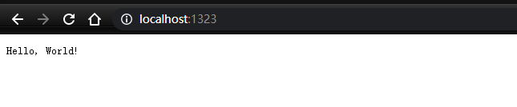

# Go mod 学习入门

参考：https://cloud.tencent.com/developer/article/1593734

## 用mod 创建新项目

1. 在`GOPATH 目录之外`新建一个目录，并使用`go mod init` 初始化生成`go.mod` 文件
    ```bash
    $ go mod init hello                              
    go: creating new go.mod: module hello                    
    $ cat go.mod
    module hello
    go 1.14
    ```
go.mod 提供了`module`, `require`、`replace`和`exclude` 四个命令
    
    - `module`  语句指定包的名字（路径）
    - `require` 语句指定的依赖项模块
    - `replace` 语句可以替换依赖项模块
- `exclude` 语句可以忽略依赖项模块
    
    
    
2. 编写一个 server.go 文件，写入以下代码：

   ```go
   package main
   
   import (
   	"net/http"
   	"github.com/labstack/echo"
   )
   
   func main() {
   	e := echo.New()
   	e.GET("/", func(c echo.Context) error {
   		return c.String(http.StatusOK, "Hello, World!")
   	})
   	e.Logger.Fatal(e.Start(":1323"))
   }
   ```

   

3. 执行 `go run server.go` 运行代码会发现 go mod 会自动查找依赖自动下载：

    ```bash
    $ go run server.go
    go: finding module for package github.com/labstack/echo
    go: downloading github.com/labstack/echo v1.4.4
    go: downloading github.com/labstack/echo v3.3.10+incompatible
    go: found github.com/labstack/echo in github.com/labstack/echo v3.3.10+incompatible
    go: finding module for package github.com/labstack/gommon/color
    go: finding module for package golang.org/x/crypto/acme/autocert
    go: finding module for package github.com/labstack/gommon/log
    go: downloading github.com/labstack/gommon v0.3.0
    go: downloading golang.org/x/crypto v0.0.0-20201221181555-eec23a3978ad
    go: found github.com/labstack/gommon/color in github.com/labstack/gommon v0.3.0
    go: found golang.org/x/crypto/acme/autocert in golang.org/x/crypto v0.0.0-20201221181555-eec23a3978ad
    go: downloading github.com/mattn/go-colorable v0.1.2
    go: downloading github.com/mattn/go-isatty v0.0.9
    go: downloading golang.org/x/net v0.0.0-20190404232315-eb5bcb51f2a3
    go: downloading github.com/valyala/fasttemplate v1.0.1
    go: downloading github.com/valyala/bytebufferpool v1.0.0
    go: downloading golang.org/x/text v0.3.0
    
       ____    __
      / __/___/ /  ___
     / _// __/ _ \/ _ \
    /___/\__/_//_/\___/ v3.3.10-dev
    High performance, minimalist Go web framework
    https://echo.labstack.com
    ____________________________________O/_______
                                        O\
    ⇨ http server started on [::]:1323
    
    ```

    访问 http://localhost:1323/ ，代码运行成功

    

4. 再次查看 `go.mod`:

    ```mod
    module hello
    
    go 1.14
    
    require (
    	github.com/labstack/echo v3.3.10+incompatible // indirect
    	github.com/labstack/gommon v0.3.0 // indirect
    	golang.org/x/crypto v0.0.0-20201221181555-eec23a3978ad // indirect
    )
    
    ```

     go module 安装 package 的原則是先拉最新的 release tag，若无tag则拉最新的commit。go 会自动生成一个 go.sum 文件来记录 dependency tree

5. 再次执行脚本 `go run server.go` 发现跳过了检查并安装依赖的步骤。

6. 可以使用命令 `go list -m -u all` 来检查可以升级的package，使用`go get -u need-upgrade-package` 升级后会将新的依赖版本更新到go.mod * 也可以使用 `go get -u` 升级所有依赖

7. go get 升级

    - 运行 `go get -u` 将会升级到最新的次要版本或者修订版本(x.y.z, z是修订版本号， y是次要版本号)
    - 运行 `go get -u=patch` 将会升级到最新的修订版本
    - 运行 `go get package@version` 将会升级到指定的版本号version
    - 运行`go get`如果有版本的更改，那么 go.mod 文件也会更改

## 引入包

新建一个 `apis.go` 文件

```bash
$ tree
.      
├── api
│   └── apis.go
├── go.mod
├── go.sum
└── server.go
1 directory, 4 files
```

```go
// apis.go
package api

import (
    "net/http"

    "github.com/labstack/echo"
)

func HelloWorld(c echo.Context) error {
    return c.JSON(http.StatusOK, "hello world")
}
```

更新`server.go`：

```go
package main

import (
    api "hello/api"  // 这里使用的不是相对路径，hello 是 module的名字
    "github.com/labstack/echo"
)

func main() {
    e := echo.New()
    e.GET("/", api.HelloWorld)
    e.Logger.Fatal(e.Start(":1323"))
}
```

