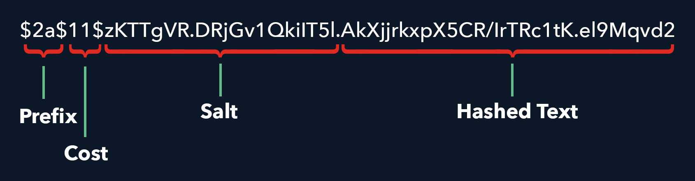

# Spring Security BCryptPasswordEncoder密码验证原理详解


## 前言

正好在学习 Spring Boot 密码加密，对 BCrypt 的加密原理很好奇，主要是不明白如何判断两个密文来自同一个明文，因为一个明文可产生多个不同的密文。

以下转自：https://www.zhangshengrong.com/p/9Oab8r76Xd/  侵删

## 一、加密算法和hash算法的区别

加密算法是一种可逆的算法，基本过程就是对原来为明文的文件或数据按某种算法进行处理，使其成为不可读的一段代码为“密文”，但在用相应的密钥进行操作之后就可以得到原来的内容 。

哈希算法是一种不可逆的算法，是把任意长度的输入通过散列算法变换成固定长度的输出,输出就是散列值，不同的输入可能会散列成相同的输出，所以不可能从散列值来确定唯一的输入值。

## 二、源码解析

BCryptPasswordEncoder类实现了PasswordEncoder接口，这个接口中定义了两个方法

```java
public interface PasswordEncoder {
  String encode(CharSequence rawPassword);
  boolean matches(CharSequence rawPassword, String encodedPassword);
}
```

其中encode(...)是对字符串进行加密的方法，matches使用来校验传入的明文密码rawPassword是否和加密密码encodedPassword相匹配的方法。即对密码进行加密时调用encode，登录认证时调用matches

下面我们来看下BCryptPasswordEncoder类中这两个方法的具体实现

### encode方法

```java
public String encode(CharSequence rawPassword) {
  String salt;
  if (strength > 0) {
    if (random != null) {
      salt = BCrypt.gensalt(strength, random);
    }
    else {
      salt = BCrypt.gensalt(strength);
    }
  }
  else {
    salt = BCrypt.gensalt();
  }
  return BCrypt.hashpw(rawPassword.toString(), salt);
}
```

可以看到，这个方法中先基于某种规则得到了一个盐值，然后在调用BCrypt.hashpw方法，传入明文密码和盐值salt。所以我们再看下BCrypt.hashpw方法中做了什么

### BCrypt.hashpw方法

```java
public static String hashpw(String password, String salt) throws IllegalArgumentException {
    BCrypt B;
    String real_salt;
    byte passwordb[], saltb[], hashed[];
    char minor = (char) 0;
    int rounds, off = 0;
    StringBuilder rs = new StringBuilder();
 
    if (salt == null) {
      throw new IllegalArgumentException("salt cannot be null");
    }
 
    int saltLength = salt.length();
 
    if (saltLength < 28) {
      throw new IllegalArgumentException("Invalid salt");
    }
 
    if (salt.charAt(0) != '$' || salt.charAt(1) != '2') {
      throw new IllegalArgumentException("Invalid salt version");
    }
    if (salt.charAt(2) == '$') {
      off = 3;
    }
    else {
      minor = salt.charAt(2);
      if (minor != 'a' || salt.charAt(3) != '$') {
        throw new IllegalArgumentException("Invalid salt revision");
      }
      off = 4;
    }
 
    if (saltLength - off < 25) {
      throw new IllegalArgumentException("Invalid salt");
    }
 
    // Extract number of rounds
    if (salt.charAt(off + 2) > '$') {
      throw new IllegalArgumentException("Missing salt rounds");
    }
    rounds = Integer.parseInt(salt.substring(off, off + 2));
 
    real_salt = salt.substring(off + 3, off + 25);
    try {
      passwordb = (password + (minor >= 'a' ? "\000" : "")).getBytes("UTF-8");
    }
    catch (UnsupportedEncodingException uee) {
      throw new AssertionError("UTF-8 is not supported");
    }
 
    saltb = decode_base64(real_salt, BCRYPT_SALT_LEN);
 
    B = new BCrypt();
    hashed = B.crypt_raw(passwordb, saltb, rounds);
 
    rs.append("$2");
    if (minor >= 'a') {
      rs.append(minor);
    }
    rs.append("$");
    if (rounds < 10) {
      rs.append("0");
    }
    rs.append(rounds);
    rs.append("$");
    encode_base64(saltb, saltb.length, rs);
    encode_base64(hashed, bf_crypt_ciphertext.length * 4 - 1, rs);
    return rs.toString();
  }
```

可以看到，这个方法中先根据传入的盐值salt,然后基于某种规则从salt得到real_salt,后续的操作都是用这个real_salt来进行，最终得到加密字符串。

所以这里有一个重点:传入的盐值salt并不是最终用来加密的盐，方法中通过salt得到了real_salt，记住这一点，因为后边的匹配方法matches中要用到这一点。

### matches方法

matches方法用来判断一个明文是否和一个加密字符串对应。

```java
public boolean matches(CharSequence rawPassword, String encodedPassword) {
  if (encodedPassword == null || encodedPassword.length() == 0) {
    logger.warn("Empty encoded password");
    return false;
  }
 
  if (!BCRYPT_PATTERN.matcher(encodedPassword).matches()) {
    logger.warn("Encoded password does not look like BCrypt");
    return false;
  }
  return BCrypt.checkpw(rawPassword.toString(), encodedPassword);
}
```

这个方法中先对密文字符串进行了一些校验，如果不符合规则直接返回不匹配，然后调用校验方法BCrypt.checkpw，第一个参数是明文，第二个参数是加密后的字符串。

```java
public static boolean checkpw(String plaintext, String hashed) {
  return equalsNoEarlyReturn(hashed, hashpw(plaintext, hashed));
}
 
static boolean equalsNoEarlyReturn(String a, String b) {
  char[] caa = a.toCharArray();
  char[] cab = b.toCharArray();
 
  if (caa.length != cab.length) {
    return false;
  }
 
  byte ret = 0;
  for (int i = 0; i < caa.length; i++) {
    ret |= caa[i] ^ cab[i];
  }
  return ret == 0;
}
```

注意 equalsNoEarlyReturn(hashed, hashpw(plaintext, hashed))这里，第一个参数是加密后的字符串，而第二个参数是用刚才提过的hashpw方法对明文字符串进行加密。

hashpw(plaintext, hashed)第一个参数是明文，第二个参数是加密字符串，但是在这里是作为盐值salt传入的，所以就用到了刚才说的 hashpw 内部通过传入的salt得到real_salt，这样就保证了对现在要校验的明文的加密和得到已有密文的加密用的是同样的加密策略，算法和盐值都相同，这样如果新产生的密文和原来的密文相同，则这两个密文对应的明文字符串就是相等的。

这也说明了加密时使用的盐值被写在了最终生成的加密字符串中。

## 三、总结

BCryptPasswordEncoder使用哈希算法+随机盐来对字符串加密。因为哈希是一种不可逆算法，所以密码认证时需要使用相同的算法+盐值来对待校验的明文进行加密，然后比较这两个密文来进行验证。BCryptPasswordEncoder在加密时通过从传入的salt中获取real_salt用来加密，保证了这一点。


## 后记

密文的组成：



跑几个代码验证一下：

```java
// 手动生成不同的盐
for (int i = 0; i < 10; i++) {
    System.out.println(BCrypt.gensalt("$2a", 10, new SecureRandom()));
}
// 输出：
$2b$10$atrUZflT0Z96W5QzTH8QUu
$2b$10$RCxX16r15iiJaP47FXmvHO
$2b$10$CqTFDEm1VrzqUUA2jKX8X.
$2b$10$4orD1IF4CL81oIF60PD.Du
$2b$10$L04sCj.38QUgBAOPPMEbLO
$2b$10$K1zE3wyJN3u./zzk7TH6v.
$2b$10$FI9NbDk3TAaur51SSGRKAu
$2b$10$cHus3QzX8YFCEpa06qrnbe
$2b$10$/9X3oRtruMy.dIwvWWIdQO
$2b$10$EAnBZEeRJBqmxo.mh0kUrO
```

```java
// 随便利用一个盐对明文“123456”进行加密
System.out.println(BCrypt.hashpw("123456", "$2b$10$atrUZflT0Z96W5QzTH8QUu"));
// 输出
$2b$10$atrUZflT0Z96W5QzTH8QUus0onZp2bl8Q3r8rrmSevygkGqIbe/16
```

```java
// 使用相同的算法+盐值来对待校验的明文进行加密
System.out.println(BCrypt.hashpw("123456".toString(), "$2b$10$atrUZflT0Z96W5QzTH8QUus0onZp2bl8Q3r8rrmSevygkGqIbe/16"));
System.out.println(BCrypt.checkpw("123456".toString(), "$2b$10$atrUZflT0Z96W5QzTH8QUus0onZp2bl8Q3r8rrmSevygkGqIbe/16"));
// 输出
$2b$10$atrUZflT0Z96W5QzTH8QUus0onZp2bl8Q3r8rrmSevygkGqIbe/16
true
    
// 把上一步密文的 hashed text 部分替换
System.out.println(BCrypt.hashpw("123456".toString(), "$2b$10$atrUZflT0Z96W5QzTH8QUu1111111111111111111111111111111"));
// 输出依旧是：
$2b$10$atrUZflT0Z96W5QzTH8QUus0onZp2bl8Q3r8rrmSevygkGqIbe/16
```

所以**密码认证时的关键**是 需要使用相同的算法+盐值来对待校验的明文进行加密，然后比较这两个密文来进行验证。