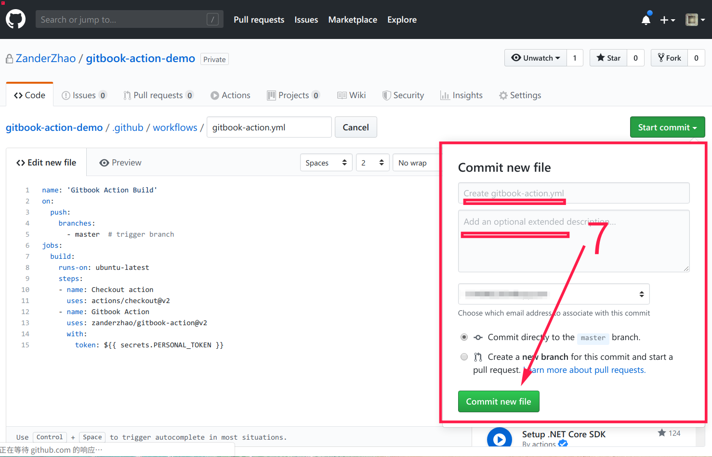
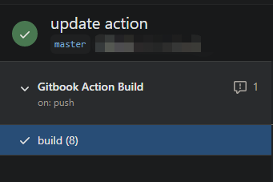

## 前言

### GitHub Action

昨天在逛 https://hellogithub.com/ 发现了一个有趣的项目： [Bilibili助手](https://github.com/srcrs/BilibiliTask) 。作为一个5级N多年的B站老粉，我“啪”的一下就把代码给clone下来了。

然后昨晚打算细看代码时候发现，竟然还有比clone下来更加优雅的运行代码的方式。

那就是 **GitHub Action**。

后来了解到其实GitHub Action早就有了，奈何我玩GitHub这么久都没有特意关注这个按钮。

关于GitHub Actions的入门可以参看这篇文章：[GitHub Actions 入门教程](http://www.ruanyifeng.com/blog/2019/09/getting-started-with-github-actions.html)，我也是刚入门，就不展开了。

### Gitbook

正好最近有在接触gitbook，也去了解了一些将gitbook部署GitHub page上的方法，基本上做法都是手动切分支gh-pages，然后push生成的静态网页文件。

可参考：[发布到 GitHub Pages](http://www.chengweiyang.cn/gitbook/github-pages/README.html)

但总觉得这样的部署方式不够优雅。自然想到了上面的 GitHub Actions 方式。

网上收了一下，确实已经有人这么做了，并且分享了action代码。


## 开工

[Gitbook Action](https://github.com/marketplace/actions/gitbook-action)

其实这里的How to Use已经写得十分详细了，照着做一遍基本就成功了。


## 后记

### 记录一下可能遇到的问题

1. 在这一步提交时候我点击commit按钮一直没有反应，索性就直接在本地新建文件，然后把代码贴进来了。然后再push上去，当然理论效果是一样的。

   
  

2. Actions 运行成功后可能不会立马生效，需要等待几分钟，特别时更新你的gitbook时候可能还会看到更新前的内容。这个和手动更新GitHub page是一样的道理的。

   

3. 现在在GitHub上建仓库时，默认的主分支名字叫main，不再是master了。若是想直接使用上面别人写好的action脚本，最简单的方式是也是用master分支。

4. 为了学习action.yml的写法，也是为了更加灵活，比如想调整触发的分支名，可以直接找到源码贴到自己的 yml 中。

   贴一些我[参考](https://github.com/ZanderZhao/gitbook-action/blob/master/archive/v1.1-simple-gitbook-action.yml)的：

   ```yml
   # @format
   
   name: 'Gitbook Action Build'
   
   on:
       push:
           branches:
               - master # trigger branch
   
   jobs:
       build:
           runs-on: ubuntu-latest
           strategy:
               matrix:
                   node-version: [8]
   
           steps:
               - uses: actions/checkout@v2
               - name: Use Node.js ${{ matrix.node-version }}
                 uses: actions/setup-node@v1
                 with:
                     node-version: ${{ matrix.node-version }}
               - name: install_gitbook_plugins
                 run: |
                     npm install gitbook-cli  -g
                     gitbook -v
                     gitbook install
               - name: build_gitbook
                 run: |
                     gitbook build
               - name: push_to_pages
                 run: |
                     cd ./_book
                     git init
                     git config --local user.name "${GITHUB_ACTOR}"
                     git config --local user.email "${GITHUB_ACTOR}@users.noreply.github.com"
                     git add *
                     git commit -m "Update by gitbook-action"
                     git push --force  "https://${GITHUB_ACTOR}:${{ secrets.PERSONAL_TOKEN }}@github.com/${GITHUB_REPOSITORY}.git" master:gh-pages
   ```

### 理解action代码

其实简单分析一下上面的代码，不难发现逻辑和我们手动部署是差不多的。简单梳理下就是：

1. checkout下来最新push的代码
2. 用Nodejs环境装好gitbook
3. 用gitbook编译出book
4. 把book里的内容添加并push到gh-pages分支
5. 到这就完了，后续GitHub会自动生成Page


这样，只需要管写Markdown文章就好了，push到GitHub后会自动部署生成网页。

GitHub Actions真的好强大，更多好玩的有待探索。

如果是不想发布在 GitHub Page 上，而是自动部署到自己的服务器上，看到了这么一篇文章：[Gitbook在云服务器上自动化部署](https://zhuanlan.zhihu.com/p/103786779)，这里用到的是Webhook，也是之前没有玩过，有待尝试。