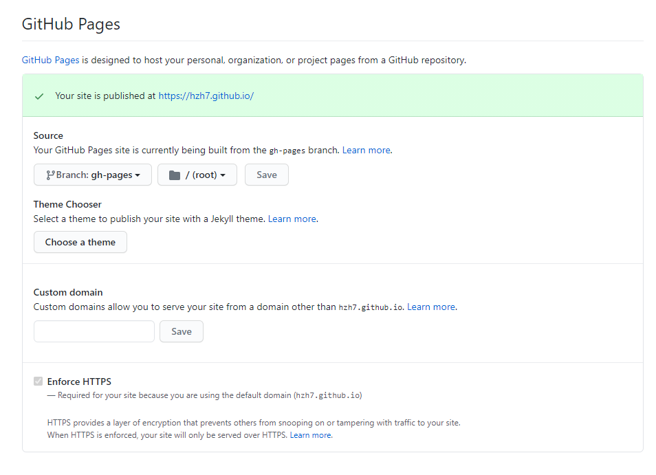

## 前言

之前用GitHub Action 自动部署了Gitbook，现在尝试用相同的思路部署 Hexo。

了解了下现有自动部署Hexo的方式，大多为利用 hexo deploy 或者使用两个仓库，一个放源码一个放页面。

将源码和页面分开放的方式，发现一些博客里的介绍都比较复杂，需要配置ssh密钥，原因是在源码仓库的action里将编译的页面代码push到另一个仓库，需要以ssh的方式验证登陆。

正好之前利用 GitHub Action 部署过 Gitbook，想到其实完全可以用这个思路照搬过来，只使用一个仓库，利用两个不同的分支，一个用于放页面，一个放网页页面代码。

## 开工

配置流程与[利用GitHubAction自动部署Gitbook](https://hzh7.github.io/2020/11/18/%E5%88%A9%E7%94%A8GitHubAction%E8%87%AA%E5%8A%A8%E9%83%A8%E7%BD%B2Gitbook/)一致，*action.yml*内容根据具体Hexo安装及使用即可：

```yml
name: 'Hexo Action Build'

on:
    push:
        branches:
            - master # trigger branch

jobs:
    build:
        runs-on: ubuntu-latest
        strategy:
            matrix:
                node-version: [12]

        steps:
            - uses: actions/checkout@v2
            - name: Use Node.js ${{ matrix.node-version }}
              uses: actions/setup-node@v1
              with:
                  node-version: ${{ matrix.node-version }}
            - name: install_hexo
              run: |
                  npm i -g hexo-cli # 安装hexo
                  npm i
                  npm install https://github.com/CodeFalling/hexo-asset-image # 图片插件
            - name: generate_hexo
              run: |
                  hexo g
            - name: push_to_pages
              run: |
                  cd ./public
                  git init
                  git config --local user.name "${GITHUB_ACTOR}"
                  git config --local user.email "${GITHUB_ACTOR}@users.noreply.github.com"
                  git add *
                  git commit -m "Update by hexo-action"
                  git push --force  "https://${GITHUB_ACTOR}:${{ secrets.PERSONAL_TOKEN }}@github.com/${GITHUB_REPOSITORY}.git" master:gh-pages

```

## 后记

在安装环境部分，有`npm install https://github.com/CodeFalling/hexo-asset-image # 图片插件`，这是因为后来在使用Typora写博客时，发现使用相对路径放置的图片在编译后不能被正确显示，找了一圈网上的解决方法，发现使用这个插件是比较优雅的方式。

GitHub上配置，若是使用 XXX.github.io 仓库，默认页面的分支是master，我这里在仓库的设置里进行了修改，用gh-pages分支展示网页，用master放源码。

