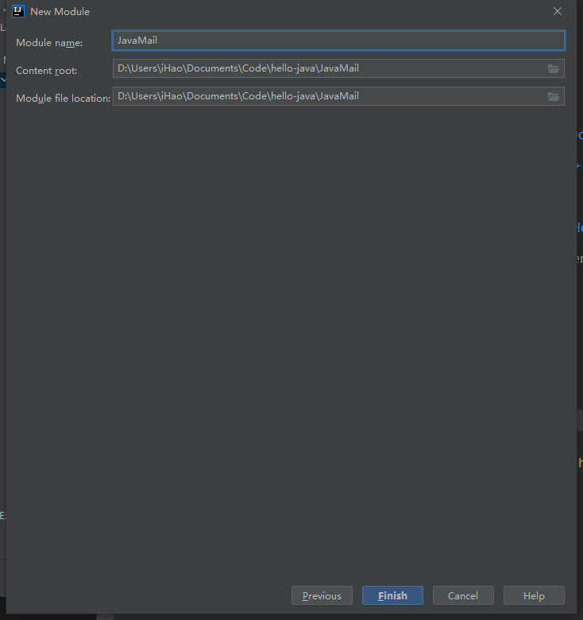
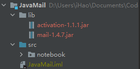
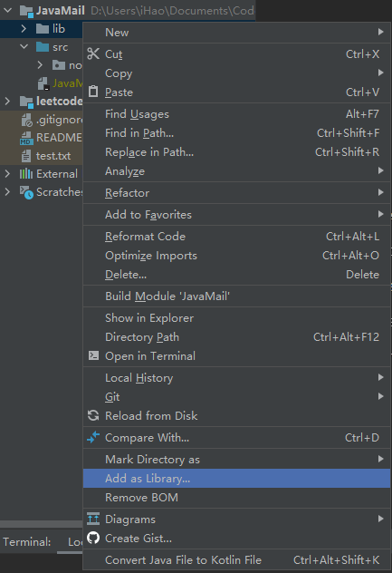
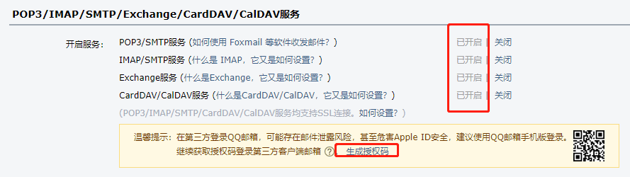
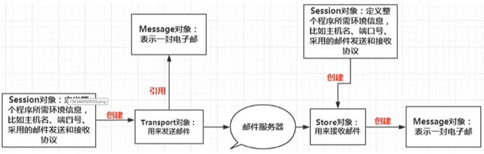

## 创建项目

Project Structure -> new Modules



## 导包

- ### 下载Jar包

  - ### [JavaMail API (compat)](https://mvnrepository.com/artifact/javax.mail/mail)  

  - [JavaBeans(TM) Activation Framework](https://mvnrepository.com/artifact/javax.activation/activation) 

创建lib文件夹并把下载的包放进来



- ### 添加进标准库




## 配置邮箱



- 开启POP3/SMTP服务

- 获取授权码

## 代码

以使用qq邮箱为例



> https://www.bilibili.com/video/BV12J411M7Sj?p=41

```java
import com.sun.mail.util.MailSSLSocketFactory;

import javax.mail.*;
import javax.mail.internet.InternetAddress;
import javax.mail.internet.MimeMessage;
import java.security.GeneralSecurityException;
import java.util.Properties;

public class MailDemo {
    public static void main(String[] args) throws GeneralSecurityException, MessagingException {
        // 配置
        Properties prop = new Properties();
        prop.setProperty("mail.host", "smtp.qq.com");
        prop.setProperty("mail.transport.protocol", "smtp");
        prop.setProperty("mail.smtp.auth", "true");

        // QQ邮箱，还需要设置SSL加密
        MailSSLSocketFactory sf = new MailSSLSocketFactory();
        sf.setTrustAllHosts(true);
        prop.put("mail.smtp.ssl.enable", "true");
        prop.put("mail.smtp.ssl.socketFactory", sf);

        // 使用JavaMail发送邮件五个步骤：

        // 1.创建定义整个应用程序所需的环境信息的Session对象
        // QQ 才有，其他邮件不用
        Session session = Session.getDefaultInstance(prop, new Authenticator() {
            @Override
            protected PasswordAuthentication getPasswordAuthentication() {
                // 发件人用户名、授权码
                return new PasswordAuthentication("hzh0608@foxmail.com", "ykfwvwywaofdbcad");
            }
        });
        // 开启Session的debug模式，这样可以查看程序发送邮件的运行状态
        session.setDebug(true);

        // 2.通过session得到transport对象
        Transport ts = session.getTransport();
        // 3.使用邮箱的用户名和授权码脸上邮件服务器
        ts.connect("smtp.qq.com", "邮箱", "授权码");
        // 4.创建邮件：写邮件
        MimeMessage message = new MimeMessage(session);
        // 发件人
        message.setFrom(new InternetAddress("邮箱"));
        // 收件人
        message.setRecipient(Message.RecipientType.TO, new InternetAddress("xxx@163.com"));
        // 主题
        message.setSubject("Java邮件主题");
        // 邮件内容
        // 1）简单邮件，正文就文字
        // message.setContent("你好，测试", "text/html;charset=utf-8");
        /*==========================================*/
        // 2）可带有附件的邮件
        MimeBodyPart file = new MimeBodyPart();
        DataHandler dh = new DataHandler(new FileDataSource("D:\\Users\\iHao\\Documents\\Code\\hello-java\\JavaMail\\src\\notebook\\javaMail.md"));
        file.setDataHandler(dh);
        file.setFileName("javaMail.md");  // 下面可引用

        MimeBodyPart text = new MimeBodyPart();
        text.setContent("这里是邮件正文", "text/html;charset=utf-8");

        MimeMultipart mm = new MimeMultipart();
        mm.addBodyPart(text);
        mm.addBodyPart(file);
        mm.setSubType("related");  // mixed, related

        message.setContent(mm);
        message.saveChanges();

        // 5.发送邮件
        ts.sendMessage(message, message.getAllRecipients());
        // 6.关闭连接
        ts.close();
    }
}
```

运行测试，成功~

