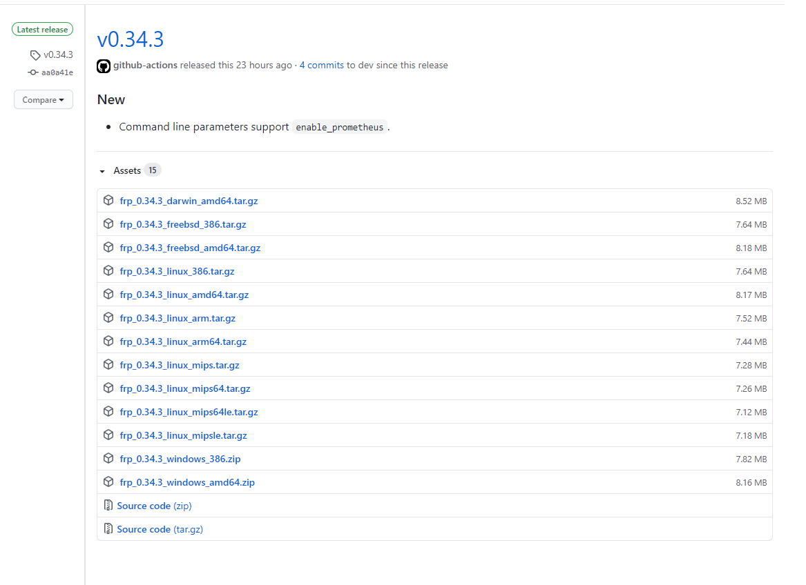

## 步骤

### 1.下载frp

新建一个frp目录，[下载地址](https://github.com/fatedier/frp/releases)



我这里是x86的Linux系统，所以下载了 frp_0.34.3_linux_386.tar.gz ，命令如下：

```bash
wget https://github.com/fatedier/frp/releases/download/v0.34.3/frp_0.34.3_linux_386.tar.gz
```

服务端和客户端都需要下载并安装。这里的服务端指有公网ip的服务器，客户端指需要被代理的内网机器。

### 解压

```bash
tar -zxvf  frp_*.tar.gz
```

### 配置

以 ssh 为例

#### 服务端配置

`frps.ini`

```ini
[common]
bind_port = 7000           #与客户端绑定的进行通信的端口

# auth token
token = 1234

# dashboard_addr = 0.0.0.0
# dashboard_port = 7500
# 仪表盘访问的用户名密码，如果不设置，则默认都是 admin
# dashboard_user = admin
# dashboard_pwd = admin
```

#### 客户端配置

`frpc.ini`

```ini
[common]
server_addr = 120.56.37.48   #公网服务器ip
server_port = 7000            #与服务端bind_port一致
# auth token
token = abcd1234567890

#公网通过ssh访问内部服务器
[ssh]
type = tcp              #连接协议
local_ip = 192.168.1.48 #内网服务器ip
local_port = 22         #ssh默认端口号
remote_port = 6000      #自定义的访问内部ssh端口号
```

### 启动

```bash
# 服务端
nohup ./frps -c ./frps.ini &
# 客户端 
nohup ./frpc -c ./frpc.ini &
```

### 使用

```bash
ssh root@42.xxx -p 6000
```

即可登录内网的机器，相当于使用了 `ssh root@192.168.1.48 -p 22`

### 配置开机自启

设置 frps 服务开机自启动，方法参考如下。

创建后台启动服务文件：

```bash
vim /etc/systemd/system/frp.service
```

内容：

```bash
[Unit]
Description=frps
After=network.target
 
[Service]  # 路径填成自己的
ExecStart=/root/frp_0.31.1_linux_amd64/frps -c /root/frp_0.31.1_linux_amd64/frps.ini
 
[Install]
WantedBy=multi-user.target
```

命令：

```bash
# 启动测试
systemctl start frp.service
# 查看启动状态
systemctl status frp.service
# 开机自启
systemctl enable frp.service
```

## 其他配置


```ini
[common]
server_addr = 42.xxx.xxx.xxx 
server_port = 7000
# auth token
token = abcd1234567890

[web]
type = tcp
local_ip = 127.0.0.1
local_port = 80
remote_port = 8080

[ftp]
type = tcp
local_ip = 127.0.0.1
local_port = 21
remote_port = 8082

[ftp_port1]
type = tcp
local_ip = 127.0.0.1
local_port = 5100
remote_port = 5100


[ftp_port2]
type = tcp
local_ip = 127.0.0.1
local_port = 5101
remote_port = 5101


[ftp_port3]
type = tcp
local_ip = 127.0.0.1
local_port = 5102
remote_port = 5102

[rdp]
type = tcp
local_ip = 127.0.0.1
local_port = 3389
remote_port = 3389

[ssh]
type = tcp
local_ip = 127.0.0.1
local_port = 22
remote_port = 2222
use_encryption = true
use_compression = false
```

远程桌面配置参考， 客户端 `frpc.ini`：

```ini
[common]
# 服务器的 IP
server_addr = 42.XXX
# 服务器上设置的服务绑定端口(frps.ini 中的 bind_port)
server_port = 7000
 
# 安全授权 token，需与服务端设置一致
token = 12345678
 
[RDP] # 反向代理名称，可以随意设置
# RDP 是 TCP 协议的
type = tcp
# 本机 IP
local_ip = 127.0.0.1
# 远程桌面的默认端口
local_port = 3389
# 外网访问的端口
remote_port = 7001
# 外网访问的域名，建议配置
# custom_domains = frp.lzw.me
 
# 如果是linux，可设置 ssh。在控制端就可以用 server_addr:remote_port 作为 ssh 登陆地址
# [ssh]
# type = tcp
# local_ip = 127.0.0.1
# local_port = 22
# remote_port = 2222
 
# 设置一个 http 服务 web
# [web]
# type = http
# local_port = 80
# custom_domains = frpweb.lzw.me
 
# 设置一个代理服务。在控制端就可以用 server_addr:remote_port 作为代理地址
# [http_proxy]
# type = tcp
# remote_port = 6000
# plugin = http_proxy
```


## 参考文献

1. [使用 FRP 实现在家远程桌面到公司内网进行远程办公](https://lzw.me/a/frp-windows-mstsc.html)
2. [十分钟教你配置frp实现内网穿透](https://blog.csdn.net/u013144287/article/details/78589643)
3. [安装 frp 内网穿透工具](https://canwdev.github.io/manual/setup-frp.html#%E6%9C%8D%E5%8A%A1%E5%99%A8%E7%AB%AF-%C2%B7-frps)

